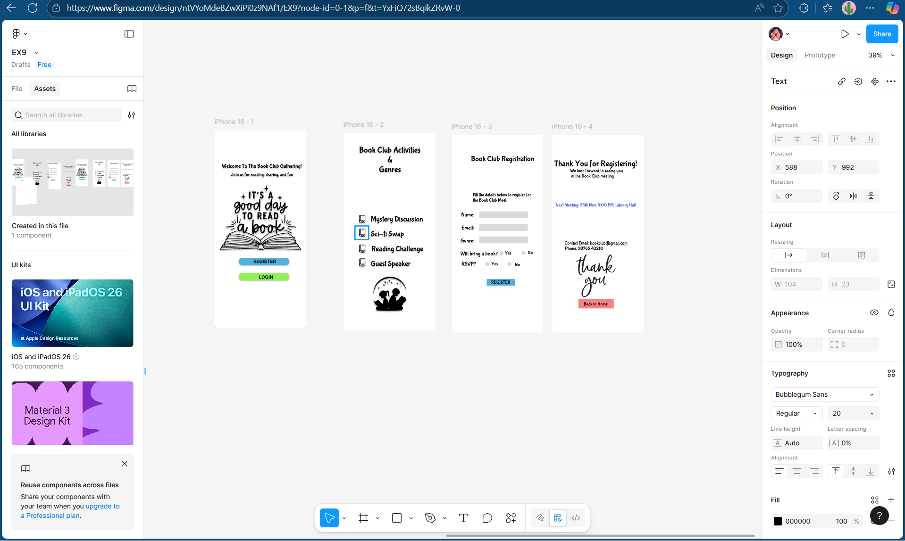

# Ex09 Event Registration Web Application
## Date:16.11.2025

## AIM:
To design, develop and deploy a web application for event registration.

## DESIGN STEPS:

### Step 1:
Create a new frame.

### Step 2:
Select any one preset size of your choice.

### Step 3:
Select the shapes you need.

### Step 4:
Import images as needed.

### Step 5:
Create pages based on your need and link them.

### Step 6:

Validate the HTML and CSS code.

### Step 6:

Publish the website in the given URL.

## DESIGN TOOL:
Figma

## CODE:
```
frame1.html


<!DOCTYPE html>
<html lang="en">
<head>
  <meta charset="UTF-8">
  <meta name="viewport" content="width=device-width, initial-scale=1.0">
  <meta name="description" content="Exported from Figma">
  <title>Exported Figma Design</title>
  <link href="https://fonts.googleapis.com/css?family=Inter&display=swap" rel="stylesheet">

  <style>
    
/* Add font files for Bubblegum Sans */
@font-face {
  font-family: 'Bubblegum Sans';
  src: url('fonts/bubblegum-sans.woff2') format('woff2'),
       url('fonts/bubblegum-sans.woff') format('woff');
  font-weight: normal;
  font-style: normal;
}
:root {
  --font-family-bubblegum-sans: 'Bubblegum Sans', sans-serif;
  --font-family-inter: 'Inter', sans-serif;
  --text-black: rgba(0, 0, 0, 1);
}

.text-black {
  color: var(--text-black);
}


/* CSS Reset */
* {
  margin: 0;
  padding: 0;
  box-sizing: border-box;
}

body {
  width: 100%;
  min-height: 100vh;
  overflow-x: hidden;
}

img {
  max-width: 100%;
  height: auto;
}

/* Prototype Links (v5.6.0) */
a.prototype-link {
  text-decoration: none;
  color: inherit;
  display: contents;
}

.text-3 {
  flex-grow: 0;
  flex-shrink: 1;
  flex-basis: auto;
  box-shadow: 0px 4px 4px 0px rgba(0,0,0,0.5);
  font-family: var(--font-family-bubblegum-sans);
  font-weight: normal;
  font-size: 24px;
  text-decoration: none;
  text-transform: none;
  color: var(--text-black);
}

.text-4 {
  flex-grow: 0;
  flex-shrink: 1;
  flex-basis: auto;
  box-shadow: 0px 4px 4px 0px rgba(0,0,0,0.5);
  font-family: var(--font-family-bubblegum-sans);
  font-weight: normal;
  font-size: 20px;
  text-decoration: none;
  text-transform: none;
  color: var(--text-black);
}

.rectangle-2-5 {
  flex-grow: 0;
  flex-shrink: 1;
  flex-basis: auto;
  box-shadow: 0px 4px 4px 0px rgba(0,0,0,0.5);
  border-radius: 15px;
  fill: rgba(78, 179, 225, 1);
  border: none;
  outline: none;
}

.rectangle-3-6 {
  flex-grow: 0;
  flex-shrink: 1;
  flex-basis: auto;
  box-shadow: 0px 4px 4px 0px rgba(0,0,0,0.5);
  background-color: rgba(141, 242, 83, 1);
  border-radius: 15px;
}

.node-7 {
  flex-grow: 0;
  flex-shrink: 1;
  flex-basis: auto;
  box-shadow: 0px 4px 4px 0px rgba(0,0,0,0.5);
  border-radius: 15px;
  width: 100%;
  height: auto;
}

.text-8 {
  flex-grow: 0;
  flex-shrink: 1;
  flex-basis: auto;
  box-shadow: 0px 4px 4px 0px rgba(0,0,0,0.5);
  font-family: var(--font-family-inter);
  font-weight: 700;
  font-size: 20px;
  text-decoration: none;
  text-transform: none;
  color: var(--text-black);
}

.page-1 {
  flex-grow: 0;
  flex-shrink: 1;
  flex-basis: auto;
  box-shadow: 0px 4px 4px 0px rgba(0,0,0,0.5);
  background-color: rgba(255, 255, 255, 1);
  border-radius: 10px;
}

.text-9 {
  flex-grow: 0;
  flex-shrink: 1;
  flex-basis: auto;
  box-shadow: 0px 4px 4px 0px rgba(0,0,0,0.5);
  font-family: var(--font-family-inter);
  font-weight: 700;
  font-size: 20px;
  text-decoration: none;
  text-transform: none;
  color: var(--text-black);
}

.iphone-16-1-1 {
@media (max-width: 1440px) {
  .iphone-16-1-1 {
    padding-left: 24px;
    padding-right: 24px;
  }
}

@media (max-width: 768px) {
  .iphone-16-1-1 {
    padding-left: 16px;
    padding-right: 16px;
  }
}
  flex-grow: 0;
  flex-shrink: 1;
  flex-basis: auto;
  background-color: rgba(255, 255, 255, 1);
}

  </style>
</head>
<body>
<div class="iphone-16-1-1">
<div class="page-1">
<p class="text-3"><span class="text-black">Welcome To The Book Club Gathering!</span></p>
<p class="text-4"><span class="text-black">Join us for reading, sharing, and fun</span></p>

<div class="rectangle-3-6"></div>

<p class="text-8"><span class="text-black">REGISTER</span></p>
</div>
<p class="text-9"><span class="text-black">LOGIN</span></p>
</div>

</body>
</html>

frame2.html


<!DOCTYPE html>
<html lang="en">
<head>
  <meta charset="UTF-8">
  <meta name="viewport" content="width=device-width, initial-scale=1.0">
  <meta name="description" content="Exported from Figma">
  <title>Exported Figma Design</title>
  
  <style>
    
/* Add font files for Bubblegum Sans */
@font-face {
  font-family: 'Bubblegum Sans';
  src: url('fonts/bubblegum-sans.woff2') format('woff2'),
       url('fonts/bubblegum-sans.woff') format('woff');
  font-weight: normal;
  font-style: normal;
}
:root {
  --font-family-bubblegum-sans: 'Bubblegum Sans', sans-serif;
  --text-black: rgba(0, 0, 0, 1);
}

.text-black {
  color: var(--text-black);
}


/* CSS Reset */
* {
  margin: 0;
  padding: 0;
  box-sizing: border-box;
}

body {
  width: 100%;
  min-height: 100vh;
  overflow-x: hidden;
}

img {
  max-width: 100%;
  height: auto;
}

/* Prototype Links (v5.6.0) */
a.prototype-link {
  text-decoration: none;
  color: inherit;
  display: contents;
}

.text-2 {
  flex-grow: 0;
  flex-shrink: 1;
  flex-basis: auto;
  box-shadow: 0px 4px 4px 0px rgba(0,0,0,0.5);
  font-family: var(--font-family-bubblegum-sans);
  font-weight: normal;
  font-size: 32px;
  text-decoration: none;
  text-transform: none;
  color: var(--text-black);
}

.text-3 {
  flex-grow: 0;
  flex-shrink: 1;
  flex-basis: auto;
  box-shadow: 0px 4px 4px 0px rgba(0,0,0,0.5);
  font-family: var(--font-family-bubblegum-sans);
  font-weight: normal;
  font-size: 32px;
  text-decoration: none;
  text-transform: none;
  color: var(--text-black);
}

.text-4 {
  flex-grow: 0;
  flex-shrink: 1;
  flex-basis: auto;
  box-shadow: 0px 4px 4px 0px rgba(0,0,0,0.5);
  font-family: var(--font-family-bubblegum-sans);
  font-weight: normal;
  font-size: 36px;
  text-decoration: none;
  text-transform: none;
  color: var(--text-black);
}

.text-5 {
  flex-grow: 0;
  flex-shrink: 1;
  flex-basis: auto;
  box-shadow: 0px 4px 4px 0px rgba(0,0,0,0.5);
  font-family: var(--font-family-bubblegum-sans);
  font-weight: normal;
  font-size: 32px;
  text-decoration: none;
  text-transform: none;
  color: var(--text-black);
}

.text-6 {
  flex-grow: 0;
  flex-shrink: 1;
  flex-basis: auto;
  box-shadow: 0px 4px 4px 0px rgba(0,0,0,0.5);
  font-family: var(--font-family-bubblegum-sans);
  font-weight: normal;
  font-size: 32px;
  text-decoration: none;
  text-transform: none;
  color: var(--text-black);
}

.text-7 {
  flex-grow: 0;
  flex-shrink: 1;
  flex-basis: auto;
  box-shadow: 0px 4px 4px 0px rgba(0,0,0,0.5);
  font-family: var(--font-family-bubblegum-sans);
  font-weight: normal;
  font-size: 36px;
  text-decoration: none;
  text-transform: none;
  color: var(--text-black);
}

.text-8 {
  flex-grow: 0;
  flex-shrink: 1;
  flex-basis: auto;
  box-shadow: 0px 4px 4px 0px rgba(0,0,0,0.5);
  font-family: var(--font-family-bubblegum-sans);
  font-weight: normal;
  font-size: 36px;
  text-decoration: none;
  text-transform: none;
  color: var(--text-black);
}

.node-9 {
  flex-grow: 0;
  flex-shrink: 1;
  flex-basis: auto;
  box-shadow: 0px 4px 4px 0px rgba(0,0,0,0.5);
  width: 100%;
  height: auto;
}

.node-10 {
  flex-grow: 0;
  flex-shrink: 1;
  flex-basis: auto;
  box-shadow: 0px 4px 4px 0px rgba(0,0,0,0.5);
  width: 100%;
  height: auto;
}

.node-11 {
  flex-grow: 0;
  flex-shrink: 1;
  flex-basis: auto;
  box-shadow: 0px 4px 4px 0px rgba(0,0,0,0.5);
  width: 100%;
  height: auto;
}

.node-12 {
  flex-grow: 0;
  flex-shrink: 1;
  flex-basis: auto;
  box-shadow: 0px 4px 4px 0px rgba(0,0,0,0.5);
  width: 100%;
  height: auto;
}

.both-1-13 {
  flex-grow: 0;
  flex-shrink: 1;
  flex-basis: auto;
  box-shadow: 0px 4px 4px 0px rgba(0,0,0,0.5);
  width: 100%;
  height: auto;
}

.iphone-16-2-1 {
@media (max-width: 1440px) {
  .iphone-16-2-1 {
    padding-left: 24px;
    padding-right: 24px;
  }
}

@media (max-width: 768px) {
  .iphone-16-2-1 {
    padding-left: 16px;
    padding-right: 16px;
  }
}
  flex-grow: 0;
  flex-shrink: 1;
  flex-basis: auto;
  background-color: rgba(255, 255, 255, 1);
}

  </style>
</head>
<body>
<div class="iphone-16-2-1">
<p class="text-2"><span class="text-black">Mystery Discussion</span></p>
<p class="text-3"><span class="text-black">Sci-fi Swap</span></p>
<p class="text-4"><span class="text-black">Book Club Activities</span></p>
<p class="text-5"><span class="text-black">Guest Speaker</span></p>
<p class="text-6"><span class="text-black">Reading Challenge</span></p>
<p class="text-7"><span class="text-black">&amp;</span></p>
<p class="text-8"><span class="text-black">Genres</span></p>


</div>

</body>
</html>


frame3.html


<!DOCTYPE html>
<html lang="en">
<head>
  <meta charset="UTF-8">
  <meta name="viewport" content="width=device-width, initial-scale=1.0">
  <meta name="description" content="Exported from Figma">
  <title>Exported Figma Design</title>
  
  <style>
    
        /* Add font files for Bubblegum Sans */
        @font-face {
        font-family: 'Bubblegum Sans';
        src: url('fonts/bubblegum-sans.woff2') format('woff2'),
            url('fonts/bubblegum-sans.woff') format('woff');
        font-weight: normal;
        font-style: normal;
        }
        :root {
        --font-family-bubblegum-sans: 'Bubblegum Sans', sans-serif;
        --text-black: rgba(0, 0, 0, 1);
        }

        .text-black {
        color: var(--text-black);
        }


        /* CSS Reset */
        * {
        margin: 0;
        padding: 0;
        box-sizing: border-box;
        }

        body {
        width: 100%;
        min-height: 100vh;
        overflow-x: hidden;
        }

        img {
        max-width: 100%;
        height: auto;
        }

        /* Prototype Links (v5.6.0) */
        a.prototype-link {
        text-decoration: none;
        color: inherit;
        display: contents;
        }

        .text-2 {
        flex-grow: 0;
        flex-shrink: 1;
        flex-basis: auto;
        font-family: var(--font-family-bubblegum-sans);
        font-weight: normal;
        font-size: 32px;
        text-decoration: none;
        text-transform: none;
        color: var(--text-black);
        }

        .text-3 {
        flex-grow: 0;
        flex-shrink: 1;
        flex-basis: auto;
        font-family: var(--font-family-bubblegum-sans);
        font-weight: normal;
        font-size: 20px;
        text-decoration: none;
        text-transform: none;
        color: var(--text-black);
        }

        .rectangle-4-4 {
        flex-grow: 0;
        flex-shrink: 1;
        flex-basis: auto;
        background-color: rgba(217, 217, 217, 1);
        }

        .rectangle-7-5 {
        flex-grow: 0;
        flex-shrink: 1;
        flex-basis: auto;
        background-color: rgba(78, 179, 225, 1);
        }

        .rectangle-6-6 {
        flex-grow: 0;
        flex-shrink: 1;
        flex-basis: auto;
        background-color: rgba(217, 217, 217, 1);
        }

        .rectangle-5-7 {
        flex-grow: 0;
        flex-shrink: 1;
        flex-basis: auto;
        background-color: rgba(217, 217, 217, 1);
        }

        .text-8 {
        flex-grow: 0;
        flex-shrink: 1;
        flex-basis: auto;
        font-family: var(--font-family-bubblegum-sans);
        font-weight: normal;
        font-size: 24px;
        text-decoration: none;
        text-transform: none;
        color: var(--text-black);
        }

        .text-9 {
        flex-grow: 0;
        flex-shrink: 1;
        flex-basis: auto;
        font-family: var(--font-family-bubblegum-sans);
        font-weight: normal;
        font-size: 24px;
        text-decoration: none;
        text-transform: none;
        color: var(--text-black);
        }

        .text-10 {
        flex-grow: 0;
        flex-shrink: 1;
        flex-basis: auto;
        font-family: var(--font-family-bubblegum-sans);
        font-weight: normal;
        font-size: 24px;
        text-decoration: none;
        text-transform: none;
        color: var(--text-black);
        }

        .text-11 {
        flex-grow: 0;
        flex-shrink: 1;
        flex-basis: auto;
        font-family: var(--font-family-bubblegum-sans);
        font-weight: normal;
        font-size: 24px;
        text-decoration: none;
        text-transform: none;
        color: var(--text-black);
        }

        .text-12 {
        flex-grow: 0;
        flex-shrink: 1;
        flex-basis: auto;
        font-family: var(--font-family-bubblegum-sans);
        font-weight: normal;
        font-size: 24px;
        text-decoration: none;
        text-transform: none;
        color: var(--text-black);
        }

        .text-13 {
        flex-grow: 0;
        flex-shrink: 1;
        flex-basis: auto;
        font-family: var(--font-family-bubblegum-sans);
        font-weight: normal;
        font-size: 20px;
        text-decoration: none;
        text-transform: none;
        color: var(--text-black);
        }

        .ellipse-1-14 {
        flex-grow: 0;
        flex-shrink: 1;
        flex-basis: auto;
        fill: rgba(217, 217, 217, 1);
        border: none;
        outline: none;
        }

        .ellipse-4-15 {
        flex-grow: 0;
        flex-shrink: 1;
        flex-basis: auto;
        fill: rgba(217, 217, 217, 1);
        border: none;
        outline: none;
        }

        .ellipse-3-16 {
        flex-grow: 0;
        flex-shrink: 1;
        flex-basis: auto;
        fill: rgba(217, 217, 217, 1);
        border: none;
        outline: none;
        }

        .ellipse-2-17 {
        flex-grow: 0;
        flex-shrink: 1;
        flex-basis: auto;
        fill: rgba(217, 217, 217, 1);
        border: none;
        outline: none;
        }

        .text-18 {
        flex-grow: 0;
        flex-shrink: 1;
        flex-basis: auto;
        font-family: var(--font-family-bubblegum-sans);
        font-weight: normal;
        font-size: 20px;
        text-decoration: none;
        text-transform: none;
        color: var(--text-black);
        }

        .text-19 {
        flex-grow: 0;
        flex-shrink: 1;
        flex-basis: auto;
        font-family: var(--font-family-bubblegum-sans);
        font-weight: normal;
        font-size: 20px;
        text-decoration: none;
        text-transform: none;
        color: var(--text-black);
        }

        .text-20 {
        flex-grow: 0;
        flex-shrink: 1;
        flex-basis: auto;
        font-family: var(--font-family-bubblegum-sans);
        font-weight: normal;
        font-size: 20px;
        text-decoration: none;
        text-transform: none;
        color: var(--text-black);
        }

        .text-21 {
        flex-grow: 0;
        flex-shrink: 1;
        flex-basis: auto;
        font-family: var(--font-family-bubblegum-sans);
        font-weight: normal;
        font-size: 20px;
        text-decoration: none;
        text-transform: none;
        color: var(--text-black);
        }

        .iphone-16-3-1 {
        @media (max-width: 1440px) {
        .iphone-16-3-1 {
            padding-left: 24px;
            padding-right: 24px;
        }
        }

        @media (max-width: 768px) {
        .iphone-16-3-1 {
            padding-left: 16px;
            padding-right: 16px;
        }
        }
        flex-grow: 0;
        flex-shrink: 1;
        flex-basis: auto;
        background-color: rgba(255, 255, 255, 1);
        }

  </style>
</head>
<body>
<div class="iphone-16-3-1">
<p class="text-2"><span class="text-black">Book Club Registration</span></p>
<p class="text-3"><span class="text-black">Fill the details below to register for 
the Book Club Meet.</span></p>
<div class="rectangle-4-4"></div>
<div class="rectangle-7-5"></div>
<div class="rectangle-6-6"></div>
<div class="rectangle-5-7"></div>
<p class="text-8"><span class="text-black">Name:</span></p>
<p class="text-9"><span class="text-black">RSVP?</span></p>
<p class="text-10"><span class="text-black">Will bring a book?</span></p>
<p class="text-11"><span class="text-black">Genre:</span></p>
<p class="text-12"><span class="text-black">Email:</span></p>
<p class="text-13"><span class="text-black">REGISTER</span></p>


<p class="text-18"><span class="text-black">Yes</span></p>
<p class="text-19"><span class="text-black">No</span></p>
<p class="text-20"><span class="text-black">Yes</span></p>
<p class="text-21"><span class="text-black">No</span></p>
</div>

</body>
</html>

frame4.html


<!DOCTYPE html>
<html lang="en">
<head>
  <meta charset="UTF-8">
  <meta name="viewport" content="width=device-width, initial-scale=1.0">
  <meta name="description" content="Exported from Figma">
  <title>Exported Figma Design</title>
  
  <style>
    
        /* Add font files for Bubblegum Sans */
        @font-face {
        font-family: 'Bubblegum Sans';
        src: url('fonts/bubblegum-sans.woff2') format('woff2'),
            url('fonts/bubblegum-sans.woff') format('woff');
        font-weight: normal;
        font-style: normal;
        }
        :root {
        --font-family-bubblegum-sans: 'Bubblegum Sans', sans-serif;
        --text-rgb-66-85-227: rgba(66, 85, 227, 1);
        --text-black: rgba(0, 0, 0, 1);
        }

        .text-rgb-66-85-227 {
        color: var(--text-rgb-66-85-227);
        }

        .text-black {
        color: var(--text-black);
        }


        /* CSS Reset */
        * {
        margin: 0;
        padding: 0;
        box-sizing: border-box;
        }

        body {
        width: 100%;
        min-height: 100vh;
        overflow-x: hidden;
        }

        img {
        max-width: 100%;
        height: auto;
        }

        /* Prototype Links (v5.6.0) */
        a.prototype-link {
        text-decoration: none;
        color: inherit;
        display: contents;
        }

        .text-2 {
        flex-grow: 0;
        flex-shrink: 1;
        flex-basis: auto;
        font-family: var(--font-family-bubblegum-sans);
        font-weight: normal;
        font-size: 20px;
        text-decoration: none;
        text-transform: none;
        color: var(--text-rgb-66-85-227);
        }

        .text-3 {
        flex-grow: 0;
        flex-shrink: 1;
        flex-basis: auto;
        font-family: var(--font-family-bubblegum-sans);
        font-weight: normal;
        font-size: 36px;
        text-decoration: none;
        text-transform: none;
        color: var(--text-black);
        }

        .text-4 {
        flex-grow: 0;
        flex-shrink: 1;
        flex-basis: auto;
        font-family: var(--font-family-bubblegum-sans);
        font-weight: normal;
        font-size: 20px;
        text-decoration: none;
        text-transform: none;
        color: var(--text-black);
        }

        .text-5 {
        flex-grow: 0;
        flex-shrink: 1;
        flex-basis: auto;
        font-family: var(--font-family-bubblegum-sans);
        font-weight: normal;
        font-size: 20px;
        text-decoration: none;
        text-transform: none;
        color: var(--text-black);
        font-family: var(--font-family-bubblegum-sans);
        font-weight: normal;
        font-size: 20px;
        text-decoration: underline;
        text-transform: none;
        color: var(--text-black);
        }

        .text-6 {
        flex-grow: 0;
        flex-shrink: 1;
        flex-basis: auto;
        font-family: var(--font-family-bubblegum-sans);
        font-weight: normal;
        font-size: 20px;
        text-decoration: none;
        text-transform: none;
        color: var(--text-black);
        }

        .rectangle-8-7 {
        flex-grow: 0;
        flex-shrink: 1;
        flex-basis: auto;
        background-color: rgba(249, 129, 129, 1);
        }

        .text-8 {
        flex-grow: 0;
        flex-shrink: 1;
        flex-basis: auto;
        font-family: var(--font-family-bubblegum-sans);
        font-weight: normal;
        font-size: 20px;
        text-decoration: none;
        text-transform: none;
        color: var(--text-black);
        }

        .oip-1-1-9 {
        flex-grow: 0;
        flex-shrink: 1;
        flex-basis: auto;
        width: 100%;
        height: auto;
        }

        .iphone-16-4-1 {
        @media (max-width: 1440px) {
        .iphone-16-4-1 {
            padding-left: 24px;
            padding-right: 24px;
        }
        }

        @media (max-width: 768px) {
        .iphone-16-4-1 {
            padding-left: 16px;
            padding-right: 16px;
        }
        }
        flex-grow: 0;
        flex-shrink: 1;
        flex-basis: auto;
        background-color: rgba(255, 255, 255, 1);
        }

  </style>
</head>
<body>
<div class="iphone-16-4-1">
<p class="text-2"><span class="text-rgb-66-85-227">Next Meeting: 25th Nov, 5:00 PM, Library Hall</span></p>
<p class="text-3"><span class="text-black">Thank You for Registering!</span></p>
<p class="text-4"><span class="text-black">We look forward to seeing you
 at the Book Club meeting</span></p>
<p class="text-5"><span class="text-black">Contact Email: bookclub@gmail.com</span></p>
<p class="text-6"><span class="text-black">Phone: 98765 43210</span></p>
<div class="rectangle-8-7"></div>
<p class="text-8"><span class="text-black">Back to Home</span></p>

</div>

</body>
</html>

```


## OUTPUT:


## RESULT:
The program to design, develop and deploy a web application for event registration is completed successfully.
